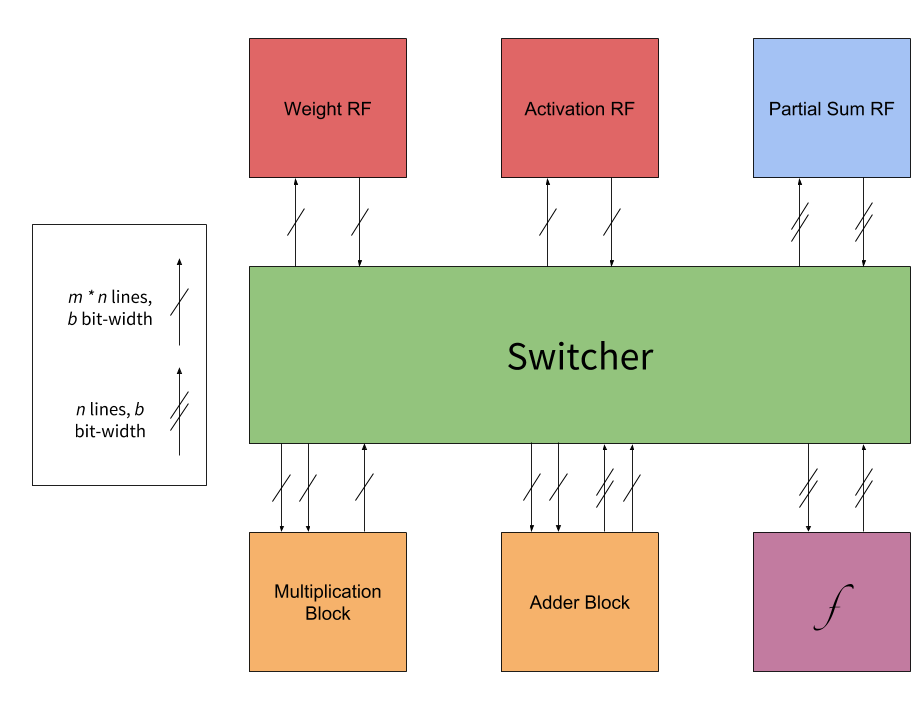

# processing-element
A course-grained reconfigurable architecture-based processing element for deep neural network accelerators. To be implemented in Scala w/ Chisel3 [1].

*Version 2*

## Overview
Arrays of processing elements (PEs) are at the heart of many deep neural network (DNN) accelerator designs [2]. This implementation presents a flexible PE design intended to emulate existing dataflows as well as generalize to emerging ones. It allows configuration both post- and pre- synthesis. The pre-synthesis configurability consists of bit-widths, SIMD parameters, number representation, multiplier/adder type, and module existence. Post-synthesis configuration consists of data routing and function selection. In other words, topological configurations are set pre-synthesis, dataflow configurations are set post-synthesis.

## Microarchitecture and Configurability

The PE microarchitecture consists of six* potential modules and a "testers.switcher". These six modules are
1. a register file for weights,
2. a register file for activations,
3. a register file for partial sums,
4. a SIMD adder,
5. a SIMD multiplier,
6. and a nonlinear function unit.

The testers.switcher connects these and determines connectvity.

\* A SIMD FMA is planned.

### Global Configurations

#### SIMD Parameters
The SIMD functionality of the PE is encoded in two parameters: the dimension (m) and number (n) of the vector inputs. This is best explained via an example. Suppose the desired operation is a 3x3 convolution on a 4x4 feature map--to be done completely simultaneously. Since the kernel is a 9 dimensional vector, this sets m to 9. Since the convolution is composed of 4 inner products, this sets n to 4. So, to complete this convolution all at once, the parameters should be 9 and 4. Using these same parameters on a 9x9 kernel and 10x10 feature map would result in computing the 4 outputs in parallel in 9 steps (81 dimension inner product done 9 components at a time). The same parameters on a 3x3 kernel and a 6x6 feature map results in the computation requiring 4 steps (16 inner products done 4 at a time). Finally, the same parameters on a 9x9 kernel and 12x12 feature map results in a 36 step convolution (16 inner products done 4 at a time, with each inner product taking 9 steps).

#### Bit-Width and Number Representation
Pre-synthesis, the PE supports a set of *fixed-width* datapaths for both integers and float, namely 8-bit, 16-bit, 32-bit and 64-bit datapaths. Note that the width of the datapath is both the input and output width, unlike architectures such as Google's TPU, whose systolic array has a 16-bit input and 32-bit output [3].

### Modules and Module-Specific Configurations

#### Switcher
The modules are connected via an all-to-all topology, controlled via the central testers.switcher. Data and timing is handled via a producer/consumer pattern. Producers cast their outputs to the testers.switcher until taken by a consumer, automatically facilitating pipelining. The testers.switcher sets multiplexers based on the producer/consumer relationships of each module, enabling single-, multi-, and broadcasting data. The producer/consumer relationships are held in a small register file in the testers.switcher; each module has a dedicated register that holds the address of the sources it draws from. Since there are likely many cycles in between processing different DNN layers, this CGRA approach minimizes the overhead routing power cost.

The addresses of each module are shown below.

| Module           | Address   |
| ---------------- | --------- |
| Weight RF        | 0         |
| Activation RF    | 1         |
| Multiplier Block | 2         |
| Adder Block      | 3         |
| Partial Sum RF   | 4         |
| Nonlinear Unit   | 5         |
| I/O              | 6, 7, ... |

#### Register Files
There are potentially register files for weights, activations, and partial sums. The only module-specific specific configuration is register size. The number of ports is automatically set via the global SIMD configuration. For the weight and activation RFs, there will be *m * n* input/output ports. For the partial sum RF there will only be *n* ports. For post-synthesis configurability, *each* of these ports must be controlled via read/write enable and address signals.

#### Adder Block
To enable both SIMD MACs and SIMD additions, the adder is slightly complicated. Pre-synthesis, its capabilities are set. It can have one or both of these abilities: *vector addition* and *reductive addition*. Parallel addition takes in two *mn*-dimensional inputs and performs standard vector addition, adding the respective components. Reductive addition takes *n* *m*-dimensional inputs and maps them each to their respective sum.

Regarding topology, an adder block capable of vector addition only will have two *mn*-dimensional input lines, one *mn*-dimensional output line, and *mn* adders. One capable of reductive addition only will have *n* *m*-dimensional inputs (expressed as one *mn*-dimensional line), *n* outputs (expressed as one *n*-dimensional line), and *n * floor(log2(m))* adders. One capable of both will have two *mn*-dimensional input lines, one *mn*-dimensional output line, one *n*-dimensional output line, *mn* adders, and an additional control signal and register to determine its configuration. The control signal must only write to the register to reconfigure the adder; it need not assert a signal every cycle.

#### Multiplier Block
The multiplier block is simply a collection of *m * n* multipliers that operate in parallel. It will perform element-wise multiplication of two *mn*-dimensional vectors. The size and type of multiplier is automatically set by the global configurations, so no manual configuring is necessary.

#### Nonlinear Function Unit
Pre-synthesis configuration for the nonlinear unit consists of determining function sets and implementations. As of right now, it only supports ReLu for *n* simultaneous integers.

## References
[1] J. Bachrach, H. Vo, B. Richards, Y. Lee, A. Waterman, R. Avizienis, J. Wawrzynek, K. Asanovic, "Chisel: Constructing Hardware in a Scala Embedded Language," in *Design Automation Conference*, 2012

[2] V. Sze, T.-J. Yang, Y.-H. Chen, and J. Emer, "Efficient Processing of Deep Neural Networks: A Tutorial and Survey," in *Proc. IEEE*, vol. 105, no. 12, pp. 2295-2329, Dec 2017

[3] N. P. Jouppi and et al, "In-datacenter performance analysis of a tensor processing unit," in *International Symposium of Computer Architecture*, 2017

[4] Y.-H. Chen, T. Krishna, J. Emer, V. Sze, "Eyeriss: An Energy-Efficient Reconfiurable Accelerator for Deep Convolutional Neural Netowrks," *IEEE Journal of Solid-State Circuits*, vol. 52, pp. 127-138, 2016
