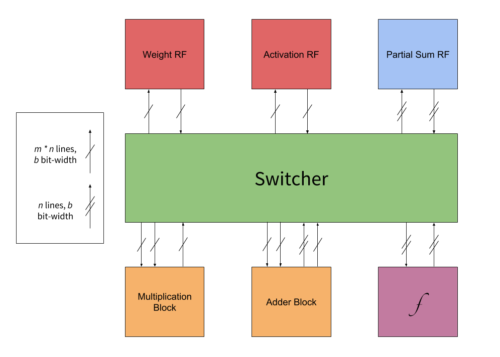

# processing-element
A processing element for course-grained reconfigurability in deep neural network accelerators. Implemented in Scala w/ Chisel3 [1].

*Version 2 Proposal.*

## Overview
Arrays of processing elements (PE) are at the heart of many deep neural network (DNN) accelerator designs [2]. This implementation presents a novel PE design intended to emulate existing data flows as well as generalize to new ones. Pre-synthesis, it allows topological and memory size configuration. Post-synthesis, it supports flexibility via a miniature on-chip network. Ideally, the pre-synthesis configurability should enable programmatic design-space exploration; the post-synthesis flexiblity should enable apples-to-apples comparisons of wavefront data flows.

## Design Philosophy
With Version 1, the primary design trade-offs were between expressive power of configuration and simplicity of use; the balance was tilted severely toward expressive power. However, for Version 2, precise topological configuration is sacrificed for both representational power and simplicity of use. With very little mandatory configuration, the PE-as-is supports a wide variety of data flows, albeit with routing overhead. Programming-like configuration for control is gone; instead, different data flows are supported via control signals. Topological configuration is limited to deciding whether or not a module exists and whether two are connected.

## Microarchitecture
The PE microarchitecture consists of five modules and a NoC. Data is transferred along with routing instructions; *i.e.,* after each module services a request, it sends the data along with further routing instructions. Since there are only 5 possible destinations, routing overhead is minimal. The PE's five modules are
1. an interface with the external array,
2. a register file (RF),
3. a SIMD adder,
4. a SIMD multiplier,
5. and a nonlinear functional unit.

### Network-on-Chip
#### Router
Every module has a specialized router for I/O. The router accepts incoming data and instructions and controls the module to service the request. It then sends the data to the next router based on instructions for further processing. To facilitate pipelining, routers are equipped with local control pipeline registers. A request (or part of a request) can be delayed up to 3 cycles. For example, suppose the PE is instructed to do a row-stationary MAC. 
1. Command 1 loads the first weight (w1) and activation (a1) into the RF. The request for a psum to the adder is delayed by a cycle.
2. Command 2 loads second weight (w2) and activation (a2) into the RF. It also stores a request for a psum into the adder. Command 1 then sends w1 and a1 to the multiplier to be multiplied. The multiplier multiplies and sends the data to the adder.
3. Command 1 sends the psum (zero since the FIFO is empty) to the adder, which adds it to the product. This psum is sent to the RF. Command 2 multiplies 
#### Links
Each of the links is equipped with a configurable register chain to facilitate pipelining. Every link may also vary in terms of width and bitwidth; *i.e.* it will be width * bitwidth wires wide. Link width and bitwidth is automatically set to match the module interfaces. 

### Register File
The register file is of configurable
1. memory size,
2. bitwidth,
3. write ports,
4. and read ports.
All read/write ports act simultaneously (how do we do half cycle r/w?), so it is up to addressing to avoid hazards.

### Adder
The adder is slightly complicated; this is to enable both SIMD MACs and SIMD additions. It is of a configurable input width and bitwidth. It can also be configured to add in parallel, as a tree, or both. For example, one configured to do both may have 256 input pairs, but based on a control signal, will either reduce groups of 16 to 16 outputs or simply add all 256 pairs in parallel. One configured as a 256:1 tree may simply always reduce 256 inputs to one output.

## Control
The PE has a decoder that will decode a non-configurable set of input signals. The set of possible input signals is limited to
1. Load Partial Sum,
2. Load Weight,
3. Load Activation,
4. Convolve,
5. Classify,
2. Normalize,
3. and Pool.
Control signals are pipelined identically to the data, allowing pipelined control.

## References
[1] J. Bachrach, H. Vo, B. Richards, Y. Lee, A. Waterman, R. Avizienis, J. Wawrzynek, K. Asanovic, "Chisel: Constructing Hardware in a Scala Embedded Language," in *Design Automation Conference*, 2012
[2] V. Sze, T.-J. Yang, Y.-H. Chen, and J. Emer, "Efficient Processing of Deep Neural Networks: A Tutorial and Survey," in *Proc. IEEE*, vol. 105, no. 12, pp. 2295-2329, Dec 2017  
